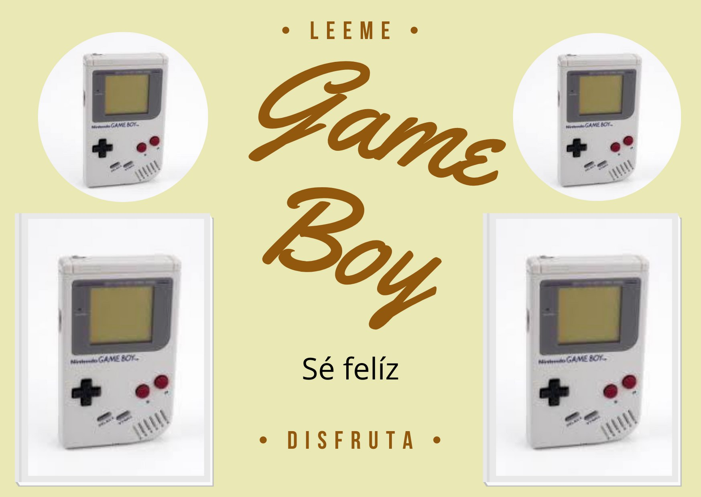

Esta vez te contaré 13 datos acerca de la Gameboy, la primera consola portátil de cartuchos de Nintendo. Comecemos:

* La Gameboy salió en Japón en: 1988
* La Gameboy salió en Estados Unidos en: 1989
* La Gameboy salió en Europa en: 1990
* Tiene accesorios oficiales:
    * Super Gameboy
    * Super Gameboy 2
    * Gameboy player
    * Gameboy camera
    * Gameboy printer
    * Batería recargable
    * Fundas
    * Bolsas
    * Maletines
    * Cable link 
    * Auriculares
    * Light Boy
    * Gameboy stereo
    * Handy Boy
* También tiene 3 accesorios no oficiales:
    * Light Boy
    * Amplifier
    * WorkBoy
* Su videojuego más vendido fue Tetris 
* Es una consola en 8 bits
* Fue descontunuada en 2003
* Cuenta con 2 rediseños:
    * Gameboy pocket
    * Gameboy light
* La Gameboy light no salió de Japón
* La Gameboy light salió en 1998
* La Gameboy pocket salió en Estados Unidos en: 1996
* La Gameboy pocket salió en Japón en: 1996
* La Gameboy pocket salió en Europa en: 1997

## FIN
