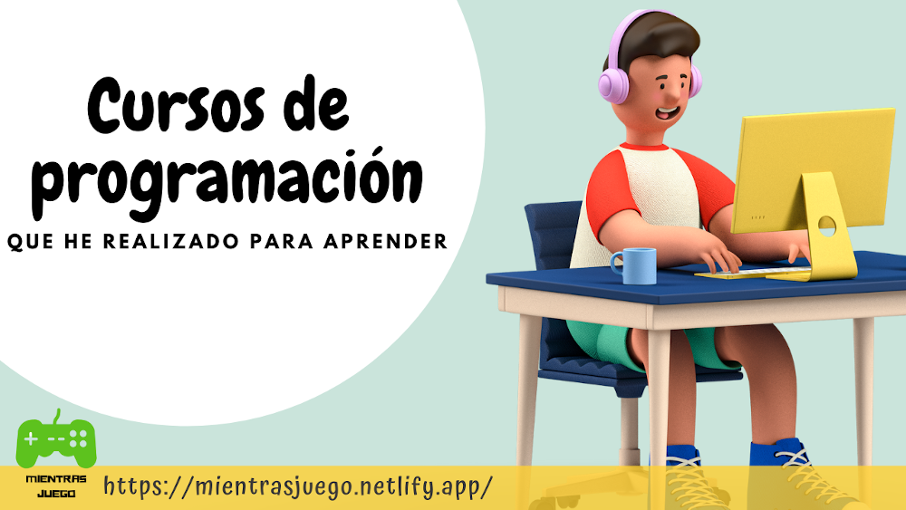

Hola y bienvenido a un nuevo post de mi blog, el dia de hoy te traigo todos los cursos de programación que he realizado, están en orden de realización, si los quieres tomar te paso el link al curso, espero que te guste, sin mas que decir comencemos

Lista de cursos que he tomado

### ¡A Programar!  Una introducción a la programación. 

En la plataforma [Coursera.org](https://www.coursera.org/learn/a-programar/) es un curso gratuito en el cual aprendí a programar utilizando Scratch, es un lenguaje de programación visual en el que se usan bloques, para iniciar en este mundo de la programación Lo hice 5 años atrás, yo no me acuerdo de este curso pero mi mamá si.

### Curso A, B, C y D. Diferentes Horas del Código. 

En la plataforma gratuita [Code.org](https://studio.code.org/) es una página en dónde hay muchos cursos para que los niños pequeños (y los que no tanto) aprendan las bases de programación, programando con bloques, algunos cursos son en javascript.

### Codecombat. 

Es de pago mensual, [Codecombat](https://codecombat.com/) es como un videojuego en el que usas python para pasar los niveles.

### Programación para principiantes - primeros pasos. 

En la plataforma [Udemy](https://www.udemy.com/course/programacion-para-principiantes) el curso es gratuito  En este curso aprendí algo de javascript, html y css, aprendí que son las variables, constantes, tipos de datos, condiciones, funciones, Document Object Model (DOM) y pensamiento lógico. El proyecto final fue hacer un ahorcado.

### Platzi curso de programación básica gratis.

En este [curso](https://platzi.com/clases/programacion-basica) aprendí mucho del Document Object Model (DOM), un proyecto del curso, era  dibujar de color rojo en un lienzo moviendo el pincel con las flechitas, otro proyecto, era para controlar un arduino con JavaScript. El curso era con JavaScript y usábamos Atom como editor de texto.

### Master en Python 3.x. Aprende de 0 a EXPERTO con Práctica.

En la plataforma [Udemy](https://www.udemy.com/course/aprende-el-lenguaje-de-programacion-python3-practicando/) el curso es gratuito. Este curso es de python enfocado a Programación orientada a objetos (POO), es un curso básico que usa Jupiter-notebook como editor de texto.

### Grasshopper. 

Es una [aplicación gratuita  de Google](https://grasshopper.app/) en la app vas a aprender javascript, si lo haces en la página, también aprenderás un poco de HTML y CSS. La app contiene 7 cursos pero 1 está en inglés, el resto está disponible en español.

### Desarrollo de juegos Web. 
Es un videotutorial de youtube llamado [Learn JavaScript by Building 7 Games - Full Course](https://www.youtube.com/watch?v=lhNdUVh3qCc)  que hice con mi papito, en este curso hicimos una Memoria, un Whack-a-mole,  un Connect 4, un Snake, un Space invaders, un Frogger y un Tetris. La verdad es que los juegos tenían muchos errores, pero nosotros los corregimos.

### Visual Studio Code: Mejora tu velocidad para codificar. 
En la [plataforma de Udemy](https://www.udemy.com/course/vscode-mejora-tu-velocidad-para-codificar) también es gratuito. Este es un curso de una hora de video, es rápido para aprender cosas de Visual Studio Code (VSC) por ejemplo: cómo hacer un multicursor o también varias extensiones que el profesor usa bastante. Es un curso chevere si quieres programar más rápido y eficiente.

### Desarrollo Web Completo con HTML5, CSS3, JS AJAX PHP y MySQL.
En la [plataforma de Udemy](https://www.udemy.com/course/desarrollo-web-completo-con-html5-css3-js-php-y-mysql) es de pago. Este es el curso que estoy haciendo actualmente, he aprendido bastante HTML5 y CSS3, como CSS flexbox y grid. He hecho 3 proyectos, después de la sección en la que estoy va una sección de javascript, después en la parte 16 empiezan las bases de datos y después php. 