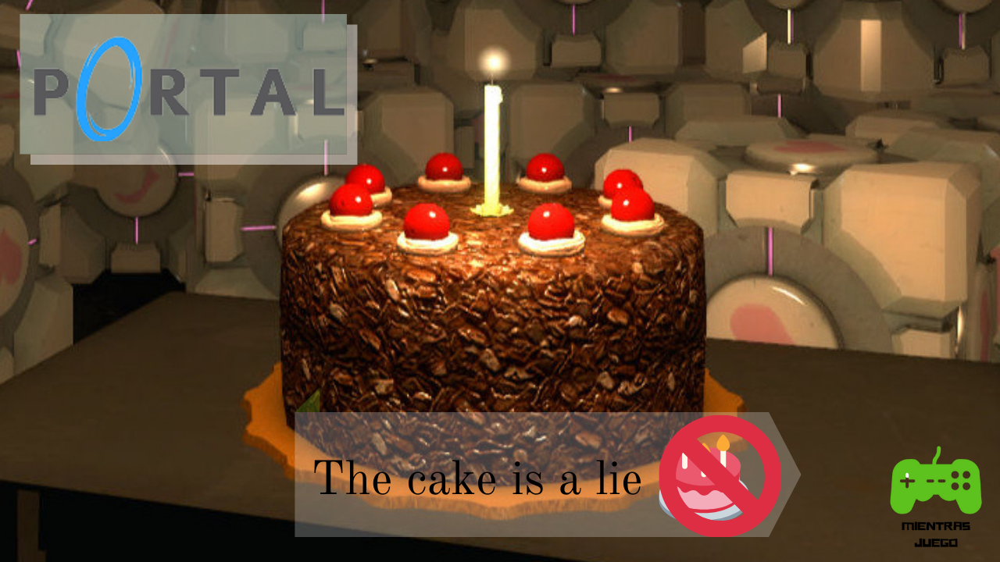

Hola a tod@s, hoy voy a contarte de P0rtal, un videojuego de puzle en primera persona. En específico su historia (la trama) pero dado a que ésta es bastante larga haré un resumen, sin más que decir, comencemos. 

El juego comienza con Chell la protagonista despertándose de su criogenización, después de una rápida test chamber 00 (que es poner un cubo en un botón para abrir la puerta), vas a la test chamber 01 qué es lo mismo pero con portales en el que el portal naranja está quieto y el azul se mueve (con un timer), en la 02 consigues tu aperture science handheld blue portal device o la portal blue gun si prefieres.

De la test chamber 02 a la 11 se introducen las mecánicas de  proyectiles de alta energía (y sus receptores), el impulso (acumularlo a través de los portales), los emancipation Grills y el andamio no estacionario de aperture science. Al final de la test chamber 11  consigues tu aperture science handheld portal device o la portal gun si prefieres.

De la test chamber 12 a la 15  no incluye nada nuevo solo que tienes 2 portales y que no tienen elevadores entre tests en la 16 se introducen las Torretas centinelas de aperture science en la 17 el cubo de compañía en la 18 se une todo torretas impulso cubos botones, proyectiles de alta energía y andamios no estacionarios, la 19 es bastante fácil no hay mucho que decir solo que: 1. Toda es en un andamio no estacionario y 2. Comienza el escape.

El escape no lo he acabado, pero colocare lo que se del escape, comienza al final de la test chamber 19 con un andamio no estacionario hacia un pozo de fuego, está dividida en 4 partes yo voy en la parte 3, hasta el momento ha habido torretas, impulso y algo parecido a un andamio no estacionario pero hacia arriba y un poco más rápidos. Voy a acabar esta parte cuando acabe el juego y venza a GLaDOS (la mala, la que me pone a hacer tests y quiere matarme),  después haré un post sobre el cómic Portal 2: rab lat.

Desde mi punto de vista Portal es un juego bastante divertido no como Portal 2 (quizá porque Portal es mucho más difícil) pero la verdad lo recomiendo, lo único malo es en Steam que no siempre funciona con control. Las plataformas para jugar son: Steam PS3 Xbox 360, MAC OS, Linux, MAC OS classic, Android y Windows
