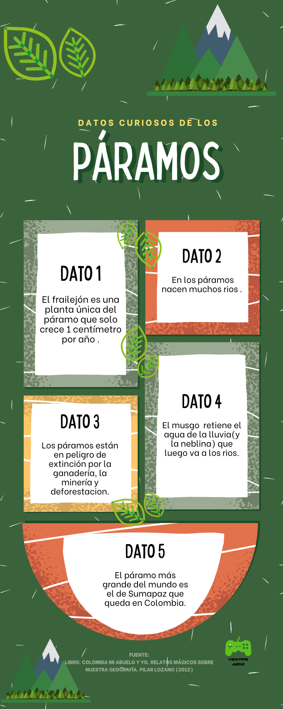

Hola, he estado estudiando sobre mi país, Colombia, así que, un día que estaba estudiando los páramos  me puse a hacer una infografía de ellos. La información la saqué de un libro llamado ***Colombia mi abuelo y yo, relatos mágicos de nuestra geografía*** escrito por ***Pilar Lozano***, es un libro que te enseña sobre Colombia, espero que les guste mi infografía

