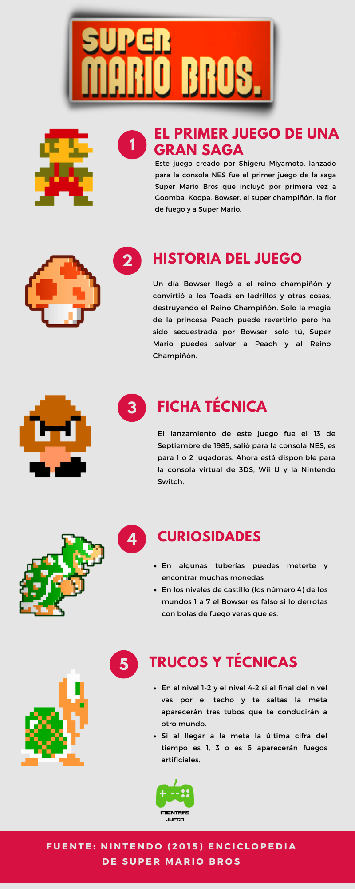

Hola, ¿Cómo vas? El dia de hoy te comparto una infografía de un tema que me gusta mucho, los videojuegos, especificamente del juego ***Super Mario Bros*** es uno de los juegos que hizo famoso a Mario y desde 1985 hasta la fecha sigue siendo un icono de Nintendo.
La información la saque de mi ***Enciclopedia de Super Mario*** es un libro de Nintendo  que salió en el año 2015 como celebración de los 30 años de Super Mario.

