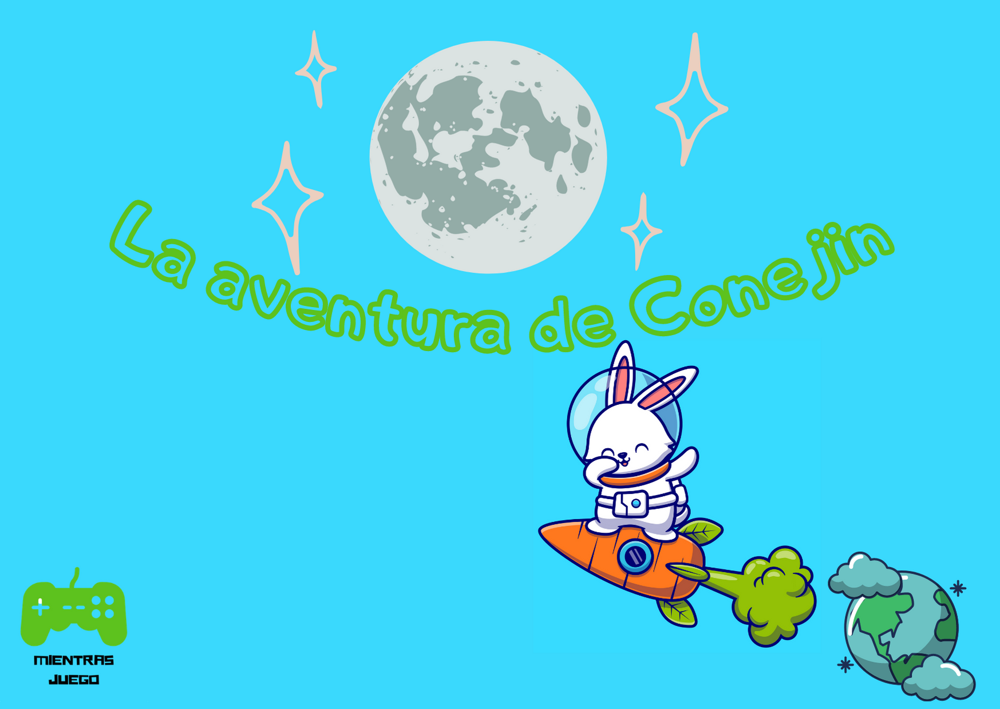

Te invito a leer este cuento sobre Conejin, está muy chevere.

Un día Conejin fué al parque que queda cerca a su casa, allí se deslizó por el tobogán, se subió a los columpios, se impulsó tanto que le dió vértigo, y mejor fue al muro de escalar, donde escaló y vió su casa; después de escalar, fué al trampolín, estando ahí, saltó tan alto que llegó a la luna.

En la luna conocio a los Selenitas una sociedad muy avanzada, al verlos Conejin se percato que tienen tres ojos y su piel era de color morado,  son amables, muy inteligentes y grandes estrategas.  Su ciudad se encuentra debajo de la superficie, para acceder, se ingresa por una casa que tiene una escalera para bajar, una vez abajo, no se ven muchos edificios, se pueden observar muchas zonas verdes y bastantes animales.

Creo que me quiero quedar a vivir acá -  Pensó Conejín al ver esta ciudad.

Así fue, Conejín con el permiso  de sus nuevos amigos vivió en la luna, se instaló en una casa muy bien decorada con una huerta en la que cultivó zanahorias y otros tubérculos. Consiguió trabajo como programador en una empresa de videojuegos que se llama Luna Games, su trabajo le gusta muchísimo, ayudo a programar juegos que se volvieron famosos.

Al cabo de unos años, Conejín extrañó su hogar en la tierra, así que pidió a los Selenitas que le construyeran un cohete para regresar a su antiguo hogar. Unas semanas después, su transporte estaba listo, por lo tanto volvió a la tierra, al aterrizar estaba en el parque donde todo comenzó, se dirigió a su casa, y vivió feliz con su familia, algunas veces cuando extraña a su amigos Selenitas mira la luna y recuerda cuando vivió allá.

Fin 

La imagen del conejo es de [freepik.es](https://www.freepik.es/vectores/diseno)
