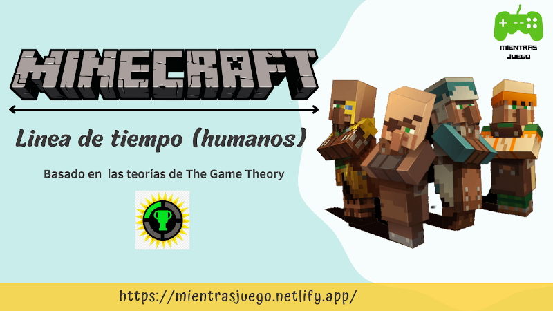

Hola y bienvenidos a un nuevo post, en el día de hoy voy a contarte como fue la línea  de tiempo de los humanos en Minecraft, este post fue inspirado por y basado en el canal de youtube [The Game theory](https://www.youtube.com/c/GameTheorists), así que si puedes suscríbete a su canal. Sin mas que decir comencemos.

Imagina un mundo de Minecraft pero sin ninguna estructura creada por humanos (minas aldeas, etcétera), así empezó todo, entonces, se generaron los humanos. Estos humanos, los antiguos constructores crearon las minas, los templos del desierto y más, los humanos que crearon los templos del desierto también crearon la tnt y a los Creepers (para proteger los  templos).

Unos años después, los antiguos constructores, construyeron muchos robots llamados Golems de hierro y algunos humanos se conformaron con sus casas así y se olvidaron de minar o crear, o construir y se convirtieron en los aldeanos. Pero otros no, un día una persona por accidente creó el portal al inframundo, allí, antes de que ellos fueran, enviaron a varios cerdos que se volvieron inteligentes convirtiéndose así en Piglings, después en el inframundo, crearon las fortalezas y a los Blazes para protegerlas, pero entonces se les ocurrió una idea loca, que con la arena de almas y unas cabezas podían volver a la vida a alguien, pero no, su experimento falló y crearon a el Wither.

Por eso se escondieron bajo tierra para que el Wither no los encontrara, creando así. la Fortaleza (la del mundo principal), también un portal a la Dimensión Fin, allí había muchos dragones y también unas plantas que te teletransportan cuando las comes. 

Los humanos crearon grandes estructuras que llamaron Ciudades del fin, para vivir en ellas, también mataron a (casi) todos los dragones. Estudiando las alas de los dragones crearon los élitros, y para proteger sus ciudades crearon a los Shulker. Mucho tiempo después por comer las plantas del fin, los humanos terminaron convirtiéndose en los Enderman. Pero bueno, esa es solo mi teoría.
