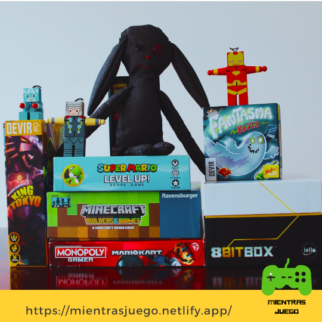

Hola, debido a la pandemia estos días he jugado bastantes juegos de mesa por ejemplo Rummy-Q, pero si no te gustan los juegos clásicos o quieres comprarte uno, he aquí una lista de mis 5 juegos de mesa favoritos (no tiene orden, osea que no está del mejor al peor ni al revés), y no, no está Rummy-Q  ni Parques. Sin más preámbulo comencemos esta lista de una vez por todas.

### 8Bit Box

8Bit Box es una consola de mesa (fusión entre consola y juego de mesa) que viene con 3 juegos preinstalados, 6 mandos, muchos cubos blancos,otros cuantos de colores y un montón de dados. En cada juego viene lo necesario para (teniendo la consola) empezar a jugar. Es de marca Devir

El primer juego: Pixoid es un juego tipo pac-man por turnos y para 3-4 jugadores, el segundo: Outspeed: es un juego tipo carreras por turnos en el que hacer trampa es parte del juego, es de 3-6 jugadores. Y por último Stadium: que es como los juegos olímpicos pero de a turnos (si, todos son por turnos)es para  4 o 6 jugadores. Se espera que saquen nuevos juegos o expansiones.

La 8Bit Box me gusta porque me encantan los videojuegos, y también los juegos de mesa, así que la fusión de esto es Ex-ce-len- te 

### Fantasma Blitz

Este juego de la marca Devir que es para 2 a 8 jugadores es de reacción y pensamiento rápido porque tienes que coger el objeto correcto primero que todos, los 5 objetos son el fantasma blanco, el ratón gris, la silla roja, el libro azul y la botella verde, trae 60 cartas. Estas son las reglas: sacar una carta del mazo y mirar sí: o A. coger el objeto que no esté ni en color ni en objeto o B. coger el objeto que coincida en color y objeto. El primero que coja el objeto correcto se queda la carta, el que tenga más cartas cuando se acabe el mazo gana.

Fantasma Blitz me gusta porque es de reacción y por que no dura mucho, además tiene una variante que es bastante más difícil.

### Super Mario Level Up

En Super Mario Level Up cada persona tiene una tarjeta con 6 personajes de 13 en total,  de los 13 personajes que tiene el juego hay  que subir uno en las plataformas  hasta llegar a la plataforma con un 10 una vez allí habrá una votación si todos votan sí, entonces el personaje gana, si no el personaje se descarta.

Cuando un personaje gana se suman los puntos de los 6 personajes que cada persona tiene en su tarjeta.  Los puntos del personaje son los mismos del número en la plataforma en que se encuentra.  Se acaba la ronda  y cojes otra tarjeta, son 3 rondas en total, el que tenga más puntos gana.
Me gusta porque es de Mario Bros  y porque dura poquito, el juego es para 3 a 6 jugadores.
	
### King Of Tokyo

En este juego eres un MONSTRUO GIGANTE que destruye Tokio, hasta que llegaron otros monstruos ahora tienes que destruirlos a ellos. En tu turno lanzas 6 dados  de 6 caras, cada cara hace algo diferente el corazón te da 1 de vida puedes tener hasta 10, la garrita hace 1 de daño, el rayito te da un rayito (cubos)  que puedes usar en comprar cartas, estas cartas te dan unos poderes especiales; y los números si sacas 3 del mismo número cojes las estrellitas que diga el número, si tienes 20 estrellitas ganas y si te quedas sin vidas perdiste.
	
King Of Tokyo me gusta porque no demora mucho y se puede jugar de 2 a 		4 jugadores.

### Minecraft: Builders & Biomes

En este juego necesitas tener más puntos al final del juego para así poder ganar, para esto tienes que construir edificios, estos tienen 3 clases: Biomas(A), materiales(B), utilidad(C), aparte cada clase tiene 4 subclases cada una te da cierta cantidad de puntos pero sólo puedes elegir una.   El  juego trae  64 cubitos pequeños para formar un gran cubo grande, algunos cubos representan obsidiana, otros arena, otros, madera y  esmeralda, estos sirven para poder comprar las construcciones. La ronda A la de los biomas se acaba cuando se cojen todos los cubos de la primera capa del cubo gigante, la B cuando se coje la segunda capa del cubo gigante y la C cuando se coje la tercera. También puedes coger puntos cuando derrotas a un monstruo.

Me gusta el juego porque es de Minecraft, se suele demorar de 30min-1h y lo pueden jugar de 2 a 4 jugadores.
