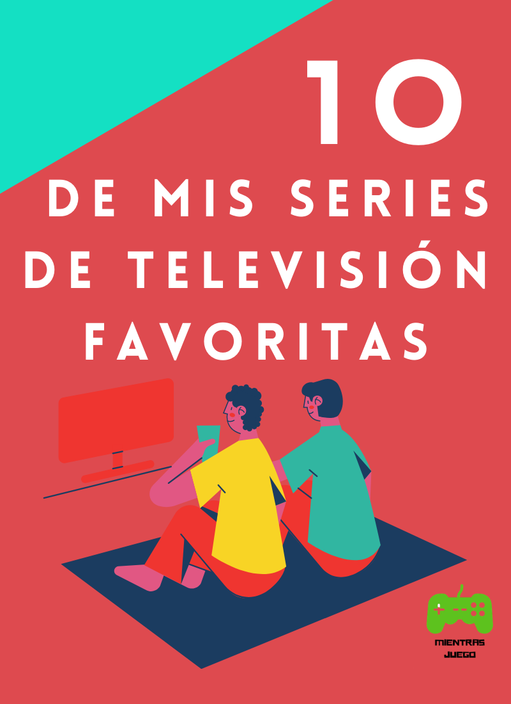

Hoy te voy a presentar mis series favoritas tanto educativas como diferentes series animadas, las cuales veo en mis momentos de ocio, espero que te gusten

### Series educativas

1. Ciencia de lo absurdo:
    * Lo veo en:
        * Disney +

    * Descripción:
    
    Videos chistosos de gente que intenta hacer cosas y no les salen bien, acá explican cómo hacerlo bien.

    * Por qué me gusta:
    
    Porque aprendo ciencia mientras me río.

2. Raro pero cierto:
    * Lo veo en:
      * Disney +
    * Descripción:
    Charlie, un científico, y Kirby, un artista,  explican en cada episodio sobre cierto tema, haciendo manualidades y visitando a personas expertas en esto.
    * Por qué me gusta:

    
    En cada episodio exploran sobre un tema y lo explican con manualidades.

3. Nat GEO lab:
    * Lo veo en:
      * Disney +
    * Descripción:

    En cada episodio realizan algunos experimentos que se pueden hacer en casa, y después explican el por qué del resultado.
    * Por qué me gusta:

    Hacen experimentos divertidos que se pueden hacer en casa.

4. Juegos mentales:
    * Lo veo en:
      * Disney +
    * Descripción:

    Explican sobre qué sucede en nuestra mente con relación al objeto o tema del que trata el episodio.
    * Por qué me gusta:

    Explican mucho sobre qué sucede en la mente humana.

5. Erase una vez el hombre
    * Lo veo en:
      * Youtube
    * Descripción:

    Este programa explica la historia de los humanos de manera animada desde el origen de la vida en la tierra y sus civilizaciones.
    * Por qué me gusta:

    Explican la historia de la humanidad en formato animado.

### Series animadas

6. Capitán calzoncillos
    * Lo veo en:
      * Netflix
    * Descripción:

    Jorge y Berto que son mejores amigos convirtieron a su director en un superhéroe llamado capitán calzoncillos.
    * Por qué me gusta:

	  Es chistosa, es divertida, es del capitán calzoncillos.

7. Kid Cosmic:

    * Lo veo en:
      * Netflix
    * Descripción:

    Trata de un niño llamado Kid que encuentra anillos mágicos extraterrestres  y los usa para combatir el mal con sus amigos.
    * Por qué me gusta:

    La serie es muy interesante, parece un cómic y además al final hay un giro en la trama.

8. Rabbids invasion:
    * Lo veo en:
      * Netflix
      * Youtube
    * Descripción:

    La serie trata de unos conejos humanoides bastante tontos que hacen locuras, normalmente intentan ir a la luna, aunque no siempre.
    * Por qué me gusta:

    Porque es muy chistosa

9. Pokémon:
    * Lo veo en:
      * Tv Pokémon
    * Descripción:

    La trama es que un niño de 10 años que se llama Ash Ketchum que quiere:
       * Atrapar a todos los pokémon
       * Ganar una liga pokemon
  	Viaja por muchas regiones con con su pikachu en cada región tiene nuevos amigos y  atrapa nuevos pokémon.
    * Por qué me gusta:

    Porque es muy divertido, los pokemon son muy cheveres, por pikachu y por las ligas pokémon.

10.  Los vecinos Green:
    * Lo veo en:
      * Disney +
    * Descripción:

      A los Green (Bill o apa, Grillo, Tily) les quitaron su granja así que se fueron a vivir con abuela la mamá de Bill, allí Grillo consigue un amigo: Remy Remington, un trabajo en Big Coffee y un enemigo: Chip Whistler que quiere sacarlos de Big City y siempre que falla se rompe el diente.
    * Por qué me gusta:

	    Porque los Green hacen locuras, y porque a Chip se le rompe el diente
