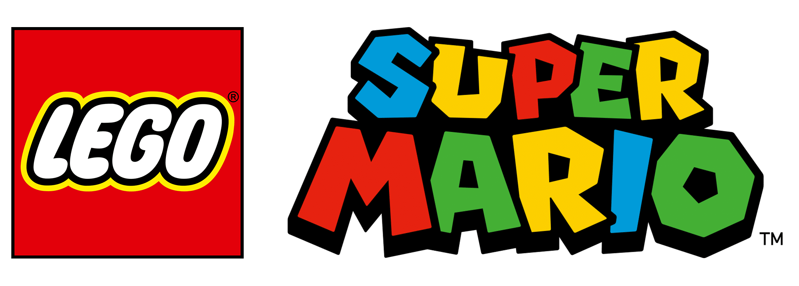
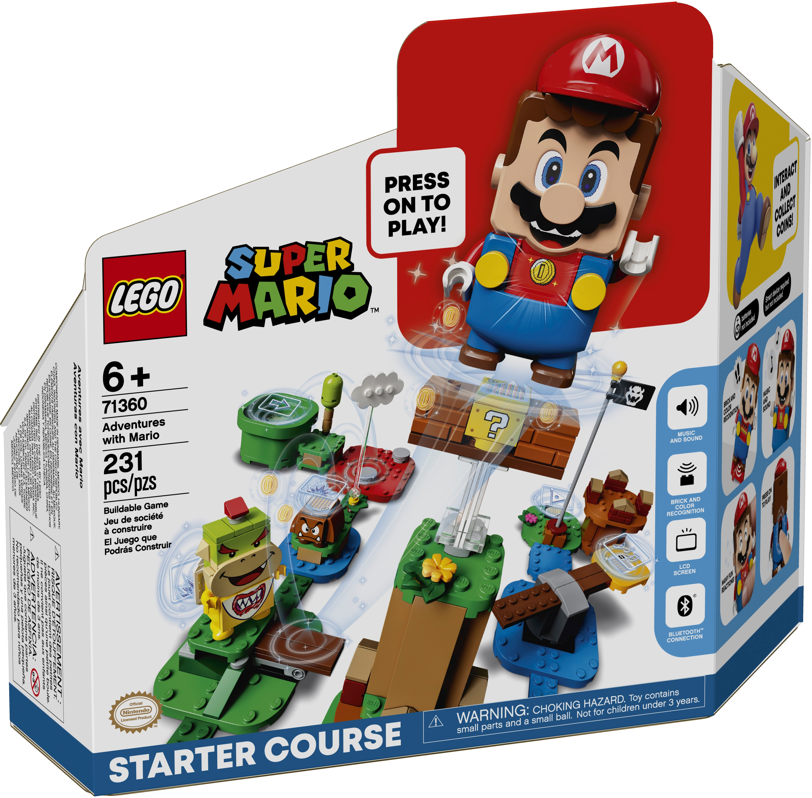
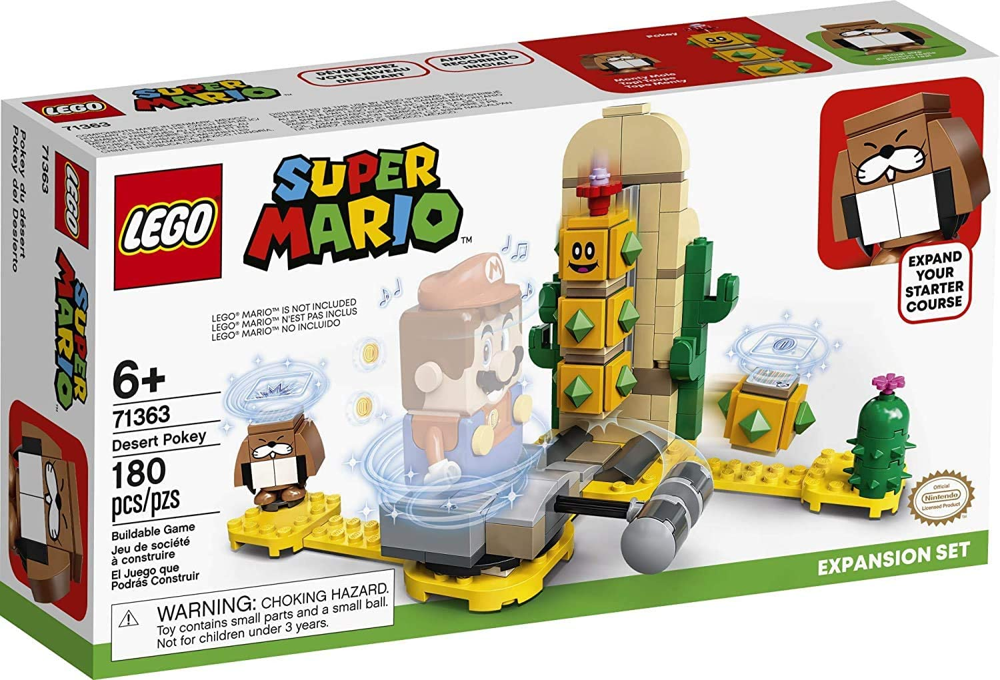
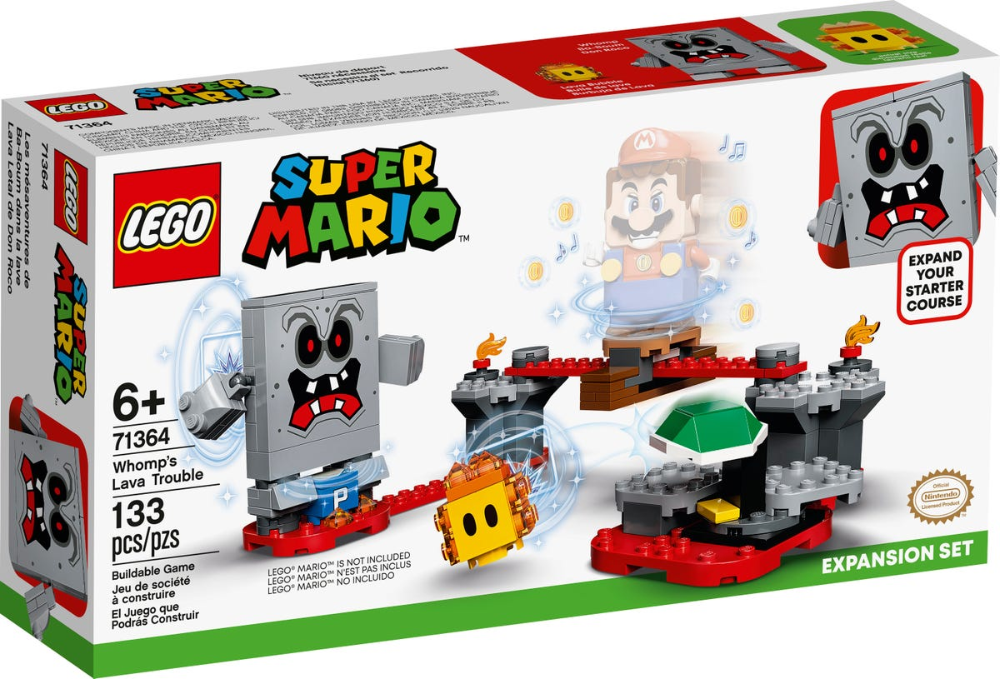
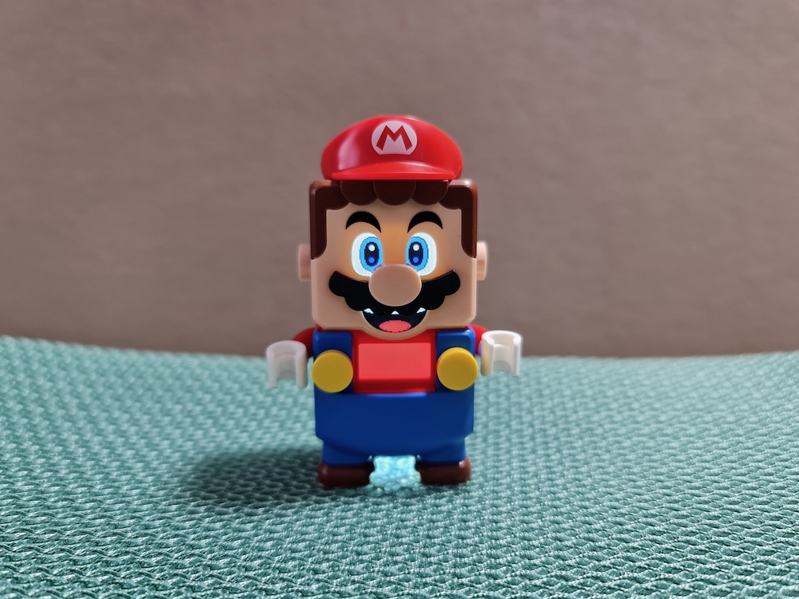

Hola hoy voy a hacer una reseña de Lego  Super Mario, Si, Mario ya tiene legos oficiales. Hoy hablaré de 3 sets. El set inicial, el set Pokey de desierto y el set Lava letal de Don Rocco, también hablaré del Mario de Lego.

Los legos Mario son fabricados por Lego con una licencia de Nintendo como celebración del 35 aniversario de Mario y se empezaron a fabricar en el 2020. ¿Sabían que han sacado 23 sets de Lego Super Mario?

#### SET INICIAL LEGO SUPER MARIO:

Este set incluye un Goomba, un Bowser Jr, el what, una nube, la meta, el tubo (el inicio), una nube que vuela, una plataforma rotatoria y el  Mario de lego. Es el único que incluye el personaje de Mario que junto con la meta y el tubo son necesarios para todos los niveles y sets. Contiene  231 piezas

Instrucciones para jugar:

1. Colocas el tubo inicial
2. Colocas el terreno donde camina Mario
3. Colocas la meta al final del nivel
4. Colocas las otras cosas.

Es muy muuuuuy divertido por unos (muchos) meses, después no tanto, ya que la gente se queda sin ideas y ya no crea niveles ni los juega.

#### SET DESIERTO POKEY:

Este set trae un topo Monty, un cactus, un Pokey y un martillo. El martillo y el Pokey siempre serán muy divertidos. Este set representa el desierto y tiene 180 piezas.

Aquí Mario se enfrenta a un topo Monty, después, hay una plataforma, un martillo y un Pokey y  tienes que mover a Mario para derrotar a Pokey y ganas

#### SET DON ROCCO:

Este set  contiene: un bloque  P. un Don Roco, y un fueguito, también, una  plataforma que se mueve. También tiene 133 piezas.
Aquí Mario pasa por una plataforma que se mueve después derrota a Don Rocco (que es un jefe) y derrota a fueguito en una plataforma rotatoria, luego de eso, con el bloque p recolecta monedas y por último gana

#### MARIO DE LEGO:

El Mario de Lego tiene conectividad bluetooth con una app donde están las instrucciones para los sets y creaciones de la comunidad, Mario usa pilas triple A , sus efectos especiales son monedas, bloque p oprimido, bandera de Mario(cuando ganas) y muchos más.

#### CONCLUSIONES

Los legos Mario son muy divertidos. aunque, son muuuy caros (así que no los rompan). Ten en cuenta que para poder derrotar a algunos enemigos tienes que comprar otro set, por ejemplo, para derrotar a Boo usas a Yoshi (que viene en otro set), A mi parecer,  sí vale la pena comprarlos porque son muy divertidos, pero también, algunas personas los coleccionan, así que, si los coleccionas o los usas para jugar yo te los recomiendo.

## FIN