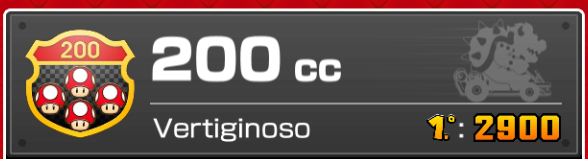
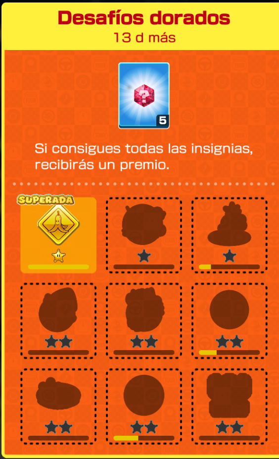

Hola, hoy te voy a contar mi reseña del pase dorado de Mario Kart Tour. Este es un juego para celular desarrollado por Nintendo, la  app es free, pero tiene contenido de pago, uno de ellos es el pase dorado. Yo probé las 2 semanas free de prueba del pase dorado y ahora haré mi reseña del mismo. El pase Dorado tiene:

* Modo de velocidad 200cc:

 Descripción: En este modo de velocidad se siente que todo va más rápido y la verdad creo que las cosas si van más rápido.

* Insignias de color dorado:

 Descripción: Son como las insignias normales de Mario Kart Tour solo que todas son doradas.

* Te dan recompensas exclusivas al recibir premios

* Te dan carreras multijugador especiales llamadas: carreras doradas:

Descripción: Es casi igual a la carrera multijugador solo tiene dos diferencias con respecto a la original las diferencias son:

1. Otras reglas: las reglas son diferentes a las de multijugador normales, por ejemplo: en la carrera multijugador normal está en modo de velocidad  50 cc y todos los personajes tienen dos ranuras para ítems.
Las carreras multijugador doradas están en modo de velocidad 200 cc y los personajes tienen tres ranuras por ítem 
2. Puede que salga en las reglas modo de velocidad 200cc

Por cierto si compras el pase dorado y te sale esto:

No te preocupes eso me salio a mi y no pasó nada. Otra cosa más, el pase dorado tiene dos semanas gratis, así que te invito a probarlas y cortarme tu experiencia.
En conclusión, si eres un jugador casual en el juego como yo no vale la pena suscribirse, pero si quieres ser el mejor y tenerlo todo en el juego, vale la pena pagar la suscripción mensual.

## FIN
