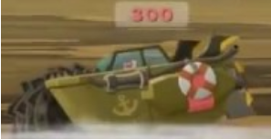

Worms W. M. D. es un juego de la saga Worms,  este fue lanzado el 23 de Agosto de 2016  por la compañía de videojuegos Team 17.  Trata de unos gusanos que se matan con montones de armas por ejemplo: bazucas, granadas, escopetas, bates, puños de fuego y muchas armas más.

El juego incluye muchas cosas nuevas con respecto a los juegos anteriores:

## NOVEDADES ##

#### VEHÍCULOS:

* Tanques: tienen el poder de una bazuca pero con 6 disparos 

[Worms W.M.D - Bob's Tank Warehouse!](https://www.youtube.com/watch?v=XesMJiTgc6g)

* Helicóptero:  ¿Que tiene el poder de una ametralladora y vuela?
R: el helicóptero 

* Mecha: causa mucha destrucción cuando imita a Hulk

* Barco de perforación: van por el mar y por tierra, tiene una  sierra para ir por estructuras

* Carro de rocket league: es muy  útil para lanzar gusanos.

Los vehículos no son todo lo nuevo también hay:

* Fabricar armas: ahora puedes fabricar armas completamente nuevas como granadas pegajosas, ovejas eléctricas, mochilas cohete ecológicas y mucho más

* Nuevas armas: (que no tienes que fabricar ) como el ataque OMG, la bateria de telefono mala y no mucho más

## CONCLUSIÓN

Desde mi punto de vista, yo que he jugado bastantes worms, teniendo en cuenta todo lo anterior diría que es el mejor worms del mundo, me encantaron las nuevas gráficas, los nuevos atuendos, los vehículos, fabricar armas  y el ataque OMG. Lo recomiendo mucho.

## FIN
