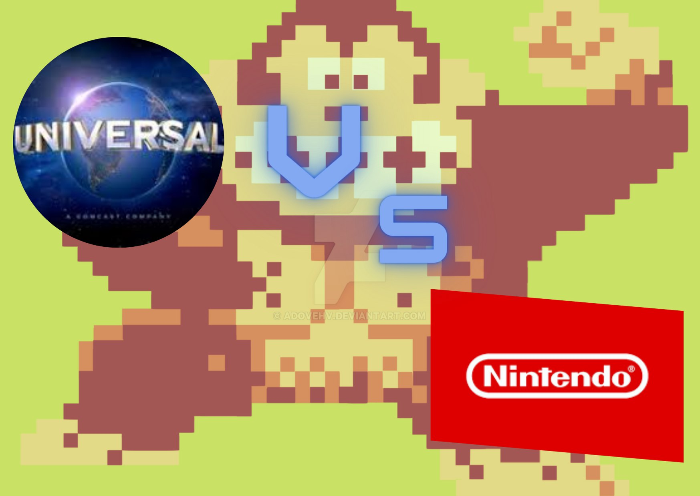

Esta vez te contare el caso de Universal VS Nintendo: lo que pasó es que Universal demandó a Nintendo porque Donkey Kong era muy parecido a King Kong porque los 2 capturan chicas y ambos se trepan en edificios (bueno, Donkey Kong en un andamio), entonces Nintendo envió a unos abogados a investigar y resulta que Donkey Kong en japones significa gorila tonto. En el juicio Nintendo ganó

## FIN
